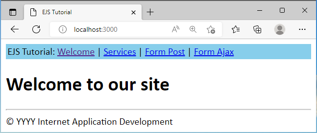
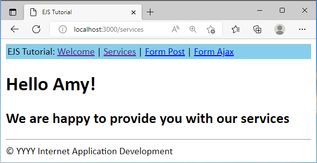
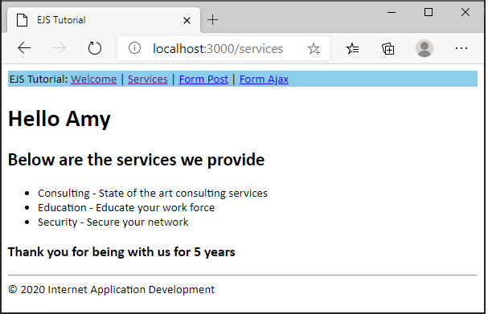

# Overview
This tutorial provides step-by-step instructions for setting up a simple web site using [EJS](https://ejs.co/) in a Node project.  It is to supplement class discussion and may not cover details of every step.

Assumptions:
- Using VSCode
- Using Express Framework

# What is EJS?
[EJS](https://ejs.co/) is a simple templating language that lets you generate HTML markup with plain JavaScript.  
Reference
- [EJS Site](https://ejs.co/)
- [EJS GitHub](https://github.com/mde/ejs)

# Steps

## File/Folder Structure
At completion of the project, your file/folder structure will be as follows
```
  - css
    -- styles.css
  - node_modules
  - views
    -- _footer.ejs
    -- _header.ejs
    -- formAjax.ejs
    -- formPost.ejs
    -- services.ejs
    -- index.ejs
  - index.js
  - package-lock.json
  - package.json
```

## 1. Create a Node Project with Express and EJS modules
1. Launch VSCode
2. Create a folder for the project.  
   - Folder name: **tutejs**  
3. Open **tutejs** folder in Integrated Terminal
4. Initiate a Node project  
   ``` npm init ``` and answer the questions  
   or  
   ``` npm init -y ``` to accept defaults
   
   - Add the "start" script to the generated package.json file:  
     ``` "start": "node index.js", ```  
     package.json contents (similar, depending on your answers)
     ```js
     {
      "name": "tutejs",
      "version": "1.0.0",
      "description": "EJS Tutorial",
      "main": "index.js",
      "scripts": {
        "start": "node index.js",
        "test": "echo \"Error: no test specified\" && exit 1"
      },
      "author": "Asher",
      "license": "ISC"
     }
     ```  
 5. Intall Express and EJS modules  
    ``` npm install express ejs ```
    
## 2. Create EJS Views and Stylesheet
### EJS
We will create header and footer views to be included in our other pages.  
Create documents in the **views** directory  
1. _header.ejs content:
```js
<!DOCTYPE html>
<html lang="en">
<head>
    <meta charset="UTF-8">
    <meta name="viewport" content="width=device-width, initial-scale=1.0">
    <title>EJS Tutorial</title>
    <link href="/styles.css" rel="stylesheet" type="text/css">
</head>
<body>
    <table width="100%">
        <tr>
            <td>EJS Tutorial: <a href="/">Welcome</a> |
                <a href="/services">Services</a> |
                <a href="/formPost">Form Post</a> |
                <a href="/formAjax">Form Ajax</a> 
            </td>
        </tr>
    </table>
```  
2. _footer.ejs content:
```js
    <hr>
    <footer>
        &copy 2020 Internet Application Development
    </footer>
</body>
</html>
```  
3. The index page will be our start page.  
index.ejs content:
```js
<%- include("_header") -%>

<h1>Welcome to our site</h1>

<%- include("_footer") -%>
```  
### Stylesheet
For now, we will create a simple style sheet.  
In a later tutorial, we will use [bootstrap](https://getbootstrap.com/).  
1. Create a folder for the stylesheet
   - Folder name: **css**  
2. Create a file 
   - File name: styles.css
   content:
   ```css
   * {
    font-family: Calibri;
   }

   table {
    background-color:  skyblue;
   }
   ```

## 3. Setup The Server  
Copy the content below to the **index.js** file.   
  - Content:
  ```js
  // Load packages and access services
  const express = require("express");
  const app = express();

  // Setup view engine to ejs
  app.set('view engine', 'ejs');

  // Serve static content directly
  app.use(express.static("css"));

  // Setup routes

  // Route to welcome page
  app.get('/', (request, response) => {
      response.render("index");
  });

  // Start listening to incoming requests
  // If process.env.PORT is not defined, port number 3000 is used
  const listener = app.listen(process.env.PORT || 3000, () => {
      console.log(`Your app is listening on port ${listener.address().port}`);
  });
  ```  
  ### Notes  
  - We must setup the server to use the EJS emplate engine  
    ``` app.set('view engine', 'ejs'); ```  
  - No need to ``` require("ejs")``` because Express handles this
  - No need to ``` app.use(express.static("views")); ``` because it is the default for EJS  
  
  ### Start the server  
  Start the server with  
  ``` npm start ``` or ``` node index.js ```  
  Test it: [http://localhost:3000/](http://localhost:3000)  
  You should see the following:  
  
  
  ## 4. Using EJS  
  View the [EJS](https://ejs.co/) site for details.  Below are the various tags:  
  - <% 'Scriptlet' tag, for control-flow, no output
  - <%_ ‘Whitespace Slurping’ Scriptlet tag, strips all whitespace before it
  - <%= Outputs the value into the template (HTML escaped)
  - <%- Outputs the unescaped value into the template
  - <%# Comment tag, no execution, no output
  - <%% Outputs a literal '<%'
  - %> Plain ending tag
  - -%> Trim-mode ('newline slurp') tag, trims following newline
  - _%> ‘Whitespace Slurping’ ending tag, removes all whitespace after it  
  
  We will use the **services.ejs** template to experiment receiving data from the server.  
  Add a route to services.ejs passing it a name.  
  Add the following to index.js:  
  ```js
  // Route to services page
  app.get('/services', (request, response) => {
      //Data
      const name = "Amy";
      response.render("services", {name: name});
  });
  ```
  Create the following file (in the views directory)  
  - Filename: services.ejs  
    content:
    ```js
    <%- include("_header") -%>

    <h1>Hello <%= name %>!</h1>
    <h2>We are happy to provide you with our services</h2>

    <%- include("_footer") -%>
    ```  
  Review the following:  
  - How the variable **name** is declared and passed in index.js
  - How the variable is used in services.ejs
  
  Stop and Start your server and go to the serivces page.  
  Test it: [http://localhost:3000/](http://localhost:3000) and click on Services or  
  [http://localhost:3000/services](http://localhost:3000/services)  
  You should see the following:  
  
  
  ### Passing more data (object with array)  
  Experiment passing additional data.
  Modify /services route in **index.js** per below:  
  ```js
  // Route to services page
  app.get('/services', (request, response) => {
      //Data
      const name = "Amy";
      const data = {
          years: 5,
          services: [
              {
                  name: "Consulting",
                  desc: "State of the art consulting services"
              },
              {
                  name: "Education",
                  desc: "Educate your work force"
              },
              {
                  name: "Security",
                  desc: "Secure your network"
              }
          ]
      };
      response.render("services",
          {
              name: name,
              data: data
          });
  }); 
  ```  
  Note:  
  - Created a **data** object containing **years** and **services** array
  - Passing data in response.render
  
  Modify **services.ejs** per below:
  ```js
  <%- include("_header") -%>

  <h1>Hello <%= name %></h1>
  <h2>Below are the services we provide</h2>
  <ul>
      <% data.services.forEach(service => { %>
          <li>
              <%= service.name %> - <%= service.desc %>
          </li>
      <% }); %>
  </ul>

  <h3>Thank you for being with us for <%= data.years %> 
      <% if(data.years > 1) { %> 
          years 
      <% } else { %> 
          year 
      <% };%>
  </h3>

  <%- include("_footer") -%>
  ```  
  Note / Review sytnax used for:
  - Loop
  - If condition  
  As you can see, this is regular JavaScript embedded in the HTML page.  Hence, Embedded JavaScript.
  
  Stop and Start your server and go to the serivces page.  
  Test it: [http://localhost:3000/](http://localhost:3000) and click on Services or  
  [http://localhost:3000/services](http://localhost:3000/services)  
  You should see the following:  
  

  ## 5. Working with Forms
  In this section, we will demonstrate processing forms.  We will experiment with:  
  - Both synchronous and asynchronous HTTP requests
  - Form enctype (encoded type)
    - application/x-www-form-urlencoded - This is the default.  Characters are endoced before sent.
    - multipart/form-data - No characters are encoded. 
    
  For illustration purposes, we will call the same form view for both GET and POST requests.  
  In the form, we'll use JavaScript to check if variables have been passed back (POST).  If so, we'll populate the form with the data entered.  
  
  ### Form POST  
  In this scenario, we will not use AJAX, just the traditional POST.  
  We will create GET and POST routes to **formPost**, passing variables back in the POST call.  
  This is simply a demonstration for you to understand how to retrieve data from a form and send it to another page.  
  
  
  
