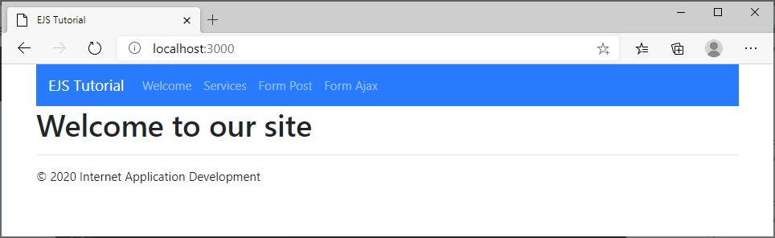
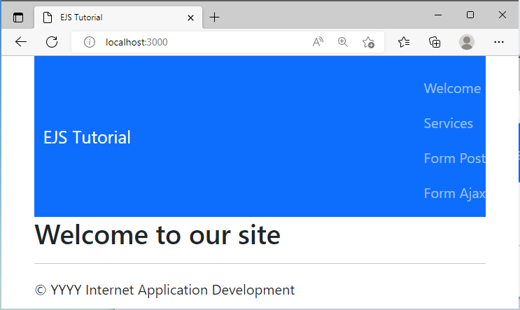
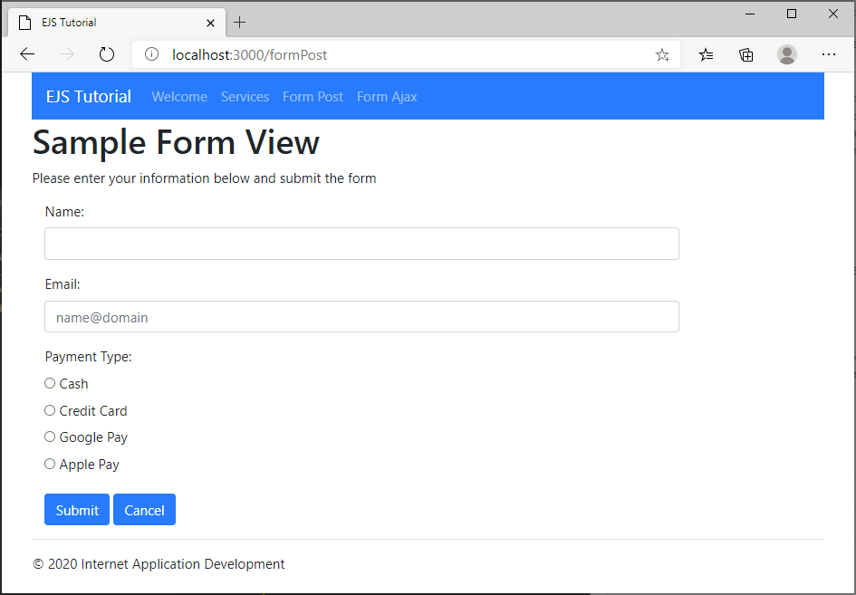

# Overview
This tutorial builds on the ejs tutorial.  It provides step-by-step instructions for using [Bootstrap](https://getbootstrap.com/) to enhance your forms.  This is not an exhaustive study of Bootstrap; it is simply used to enhance the navigation bar and the forms previously created.  This is a supplement to class discussion and may not cover details of every step.

Assumptions:
- Using VSCode
- Using Express Framework
- Completed previous EJS tutorial

Note:
- Images shown with year 2020 in the footer, for your application show the current year

# 1. What is Bootstrap  
[Bootstrap](https://getbootstrap.com/) is a popular front-end open source toolkit, featuring Sass variables and mixins, responsive grid system, extensive prebuilt components, and powerful JavaScript plugins.  
It is a CSS Framework for developing responsive and mobile-first websites.

# 2. Add Bootstrap  
1.  Make a copy of your EJS solution:  
    Copy the tutejs directory to **tutejsBootstrap**
    
2.  Add the CSS stylesheet to your solution.  
    There are two options:
    - Link to a CDN (content delivery network) 
    - Download the file and add it to your solution  
    
    To get up and running quickly, we will link to a CDN.  
    Modify the **_header.ejs** file (change the stylesheet link to the CDN)  
    Content:
    ```js
    <!DOCTYPE html>
    <html lang="en">
    <head>
        <meta charset="UTF-8">
        <meta name="viewport" content="width=device-width, initial-scale=1.0">
        <title>EJS Tutorial</title>
        <link rel="stylesheet" href="https://cdn.jsdelivr.net/npm/bootstrap@4.5.3/dist/css/bootstrap.min.css" integrity="sha384-TX8t27EcRE3e/ihU7zmQxVncDAy5uIKz4rEkgIXeMed4M0jlfIDPvg6uqKI2xXr2" crossorigin="anonymous">
    </head>
    <body>
        <table width="100%">
            <tr>
                <td>EJS Tutorial: <a href="/">Welcome</a> |
                    <a href="/services">Services</a> |
                    <a href="/formPost">Form Post</a> |
                    <a href="/formAjax">Form Ajax</a> 
                </td>
            </tr>
        </table>
    ```  
# 3. Bootstrap Navigation Bar  
Modify the _header.ejs file to use Bootstraps navigation bar.  
Updated _header.ejs content:  
```js
<!DOCTYPE html>
<html lang="en">
<head>
    <meta charset="UTF-8">
    <meta name="viewport" content="width=device-width, initial-scale=1.0">
    <title>EJS Tutorial</title>
    <link rel="stylesheet" href="https://cdn.jsdelivr.net/npm/bootstrap@4.5.3/dist/css/bootstrap.min.css" integrity="sha384-TX8t27EcRE3e/ihU7zmQxVncDAy5uIKz4rEkgIXeMed4M0jlfIDPvg6uqKI2xXr2" crossorigin="anonymous">
</head>
<body>
    <div class="container">
        <nav class="navbar navbar-expand-lg navbar-dark bg-primary">
            <a class="navbar-brand">EJS Tutorial</a>
            <ul class="navbar-nav mr-auto mt-2 mt-lg-0">
                <li class="nav-item">
                    <a class="nav-link" href="/">Welcome</a>
                </li>
                <li class="nav-item">
                    <a class="nav-link" href="/services">Services</a>
                </li>
                <li class="nav-item">
                    <a class="nav-link" href="/formPost">Form Post</a>
                </li>
                <li class="nav-item">
                    <a class="nav-link" href="/formAjax">Form Ajax</a>
                </li>
            </ul>
        </nav>
    

```  

Modify the _footer.ejs file to close the <div> tag created in the header.  
Updated _footer.ejs content:  
```js
        <hr>
        <footer>
            &copy 2022 Internet Application Development
        </footer>
    </div>
</body>
</html>  
```

Start the server and view the updated navigation bar.  You should see the following:  
  

If you resize your browser (small width), the navbar will collapse and appear as below:  
  

Look at the Bootstrap website and experiment with other colors, margins, etc...   

# 4. Bootstrap Form  
Modify the formPost.ejs file to use Bootstraps horizontal form.  
(Below shows with enctype="multipart/form-data".  Modify this if you removed this in the previous tutorial.)
Updated formPost.ejs content:   
```js
<%- include("_header") -%>

<h1>Sample Form View</h1>

<% if (message === "get") { %>
    <p>Please enter your information below and submit the form</p>
<% } else { %>
    <p>Below is the data you entered</p>
<% } %>

<form class="form-horizontal" enctype="multipart/form-data" action="/formPost" method="POST">
    <div class="form-horizontal">
        <div class="form-group">
            <label class="control-lable col-sm-2" for="name">Name:</label>
            <div class="col-sm-10">
                <input type="text" class="form-control" name="name" id="name" value="<%= data.name %>" required>
            </div>
        </div>
        <div class="form-group">
            <label class="control-lable col-sm-2" for="name">Email:</label>
            <div class="col-sm-10">
                <input type="email" class="form-control" name="email" id="email" value="<%= data.email %>" required placeholder="name@domain">
            </div>
        </div>
        <div class="form-group">
            <div class="col-sm-offset-2 col-sm-10">
                <div class="radio">
                    <label>Payment Type:</label><br>
                    <input type="radio" name="payment" id="cash" value="cash">
                    <label for="cash">Cash</label>
                    <br>
                    <input type="radio" name="payment" id="cc" value="cc">
                    <label for="cc">Credit Card</label>
                    <br>
                    <input type="radio" name="payment" id="gpay" value="gpay">
                    <label for="gpay">Google Pay</label>
                    <br>
                    <input type="radio" name="payment" id="appay" value="appay">
                    <label for="appay">Apple Pay</label>
                </div>
            </div>
        </div>
        <div class="form-group">        
            <div class="col-sm-offset-2 col-sm-10">
              <button type="submit" class="btn btn-primary">Submit</button>
              <button type="reset" class="btn btn-primary">Cancel</button>
            </div>
        </div>
    </div>
</form>

<% if (message === "post") { %>
    <script>document.getElementById("<%= data.payment %>").checked = true;</script>
<% } %>    

<%- include("_footer") -%>
```  
Stop / Start the server and view the updated form.  You should see the following:  
  

Experiment with other form options.  
Optional: Modify formAjax.ejs  
