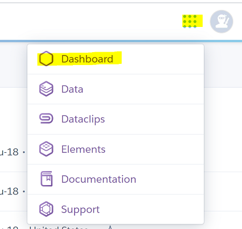
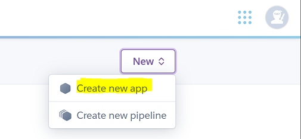

# Overview
This tutorial is to get you started with Heroku.  In this tutorial you will:  
- Create a Heroku Account
- Create an application (Deploy from GitHub repository)  

**Prerequisites:**
1. You have a GitHub account
2. You have an application in a GitHub repository to deploy to Heroku

# Create account
Link: [Heroku Home Page](https://www.heroku.com/home)  

Create an account.  
Use the same e-mail you used for your GitHub account.  

# Create Application / Deploy from GitHub Repository  
1.  Log in to your Herorku account  
2.  Go to the Dashboard (Click top right next to your user icon, then select Dashboard)  
      
3.  Click the "New" icon, then select "Create new app"  
      
4.  Enter the App name (e.g. asherapp)  --> Click "Create app"  
5.  In the "Deployment method" select "GitHub" and connect to your repository  
6.  Deploy the application.  Select either:  
    - Automatic deploys, or  
    - Manual deploy  
7.  Assuming no issues, you will receive a confirmation message with a link to view the application
8.  Click on the view to test the application  
9.  View application settings  
    - Go to the Dashboard  
    - Click on your application  
    - Click on settings  
    
**Note**  
- You can have 5 free applications with an unverified account  
- You can have 100 free applications with a verified account (must provide a credit card)  

# Summary  
You completed the following:  
- Created a Heroku account  
- Deployed an application from an existing GitHub repository 
