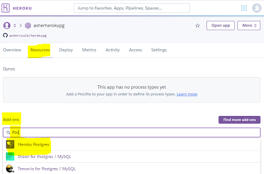
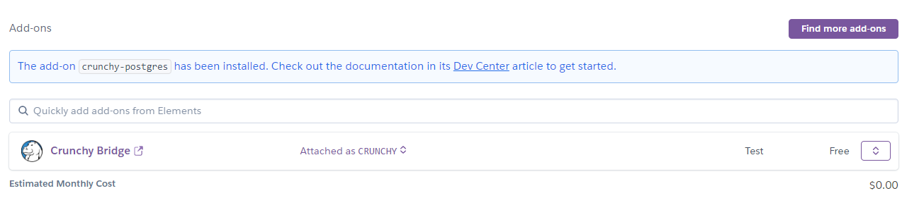

# Overview  
In this tutorial you will create an application on Heroku with a PostgreSQL database.  
The focus will be on getting the database setup in Heroku and connecting to it from your local machine using the Heroku CLI.  
In a future tutorial, we will implement an application using a back end PostgreSQL database.  

**Prerequisites:**
- GitHub account / Git installation
- Heroku account  

### High Level Steps ###
1. Setup the Environment
   - Install Heroku CLI
   - Install PostgreSQL Client

2. Create a GitHub Repository / Deploy to Heroku 
   - Clone the repository to your client  
   - Add remote connection to Heroku

3. Client Connection to PostgreSQL / Database Commands  

# Setup Environment  
You will need to install the following:  
- Heroku CLI
- PostgreSQL Client  

### Install Heroku CLI ###  
It is recommended that you go through the following Heroku tutorial:  
[Getting Started on Heroku with Node.js](https://devcenter.heroku.com/articles/getting-started-with-nodejs#set-up)  

The tutorial contains a "Set up" section with instructions to install the Heroku CLI.  

**Notes:**  
- Main goal is to install the Heroku CLI.  
  - If you don't run through the entire tutorial, at least read the steps
- Windows User Acccount Control - If you the application will not load due to Windows UAC, you can install it as follows:
  - Lanuch "command prompt" as an Administrator
  - Install from the command prompt: e.g. _yourpath>_heroku-x64.exe

### Install PostgreSQL Client ###
See the following link at the Heroku website for PostgreSQL client installation:  
[Heroku - PostgreSQL Local Setup](https://devcenter.heroku.com/articles/heroku-postgresql#local-setup)  

Below is a link to download and install PostgreSQL:  
[PostgreSQL Database Download](https://www.enterprisedb.com/downloads/postgres-postgresql-downloads)  

**Notes:**  
- Download the latest version for your platform  
- Install the following:
  - Command Line Tools (mandatory)
  - pgAdmin
  - Stack Builder
  - Optional: Database Server (only if you want a local database server)  
  
 **Note:**  
 - Make sure to add the **/bin** directory to your path
  
 # Create a GitHub Repository / Deploy to Heroku  
 We are going to emulate the steps to create an application starting with a GitHub repository.  
 
 **Note:  **
 We can create an application or a just a database in Heroku and skip GitHub altogether.  However, steps shown here are emulating the process of using GitHub for source control.  
 
 1. Create a repository in GitHub, e.g. **herokupg**  
     - Select "Add .gitignore" and select the **Node** template  

 2. Local Machine: Launch VSCode and clone the repository (you should be familiar with these steps already)  
    - Click on "Source Control"  (left vertical bar icon)  
    - Click "Clone Repository"  
    - Click "Clone from GitHub"
    - Enter repository name (or search)
    - Enter local folder name
    - Open folder
    - Open integrated terminal  

 3.  Heroku  
     Create a new application (your last name followed by "herokupg"), e.g.: **asherherokupg**  
     1. Deploy the repository created above from GitHub  
     **Note:**  
     **Build will fail** - We don't have an app yet.  It's OK, the goal is to experiment with PostgreSQL 
     2.  Click on the application **Resources** tab  
         --> In the **Add-ons** section, start typing `Pos` (Matching add-ons will show)  
         --> Then, select **Heroku Postgres**  
         --> Submit Order Form (for the Hobby Dev - Free plan)  
           

         The Heroku Postgres add-on will be created:  
            
     3. View Only: Click on the "Heroku Postgres" link  
        --> Click the **Settings** tab  
        --> Click "View Credentials..." button  
        Note the following (copy and paste them to review later):  
        - URI  
        - Heroku CLI  
     4. Get the application URL  
        - Go to the Dashboard  
        - Click on your application  
        - Click on the **Settings** tab  
          Note the following (copy and save it to use later):  
          Heroku git URL:  
        
 4. Local Machine  
    Issue the following at the Terminal
    1. ```heroku login```  
       Launch the browser and log in.
    2. ```heroku config```  
       You will get an error that the application is missing.  
       First solution is to enter the application name.  Next is to add the Heroku remote Git path.  
    3. ```heroku config --app asherherokupg``` (use your app name)  
       You will see the DATABASE_URL (This is the same as the URI setting you saw in Heroku above)  
    4. Add the remote "Heroku git URL" to your local environment  
       Can do this from VSCode or Command Line.  I'll show the CLI command.  Issue following command:  
       ```git remote add heroku https://git.heroku.com/yourHerokuGitUrl.git```  (Use your Heroku git URL from above)  
    5. ```heroku config```  
       Note: since you added the applications git URL, it is the defaul application for Heroku CLI commands and you do not need to use the --app parameter  

# Client Connection to PostgreSQL / Database Commands  
  The following will explain how to connect to the remote database and issue database commands.  
  The following commands will be issued at the Terminal  
  1. Connect to the database with the PostgreSQL client  
     ```heroku pg:psql```  
     You should see output similar to below:
     ```
     --> Connecting to postgresql-horizontal-XXXXX
     psql (13.1, server 12.5 (Ubuntu 12.5-1.pgdg16.04+1))
     WARNING: Console code page (437) differs from Windows code page (1252)
              8-bit characters might not work correctly. See psql reference
              page "Notes for Windows users" for details.
     SSL connection (protocol: TLSv1.2, cipher: XXXXX-RSA-XXXXX-XXX-XXXXX, bits: 256, compression: off)
     Type "help" for help.

     asherherokupg::DATABASE=>
     ```

 2. See existing tables  
     ```\d```  
     You should see the following:  
     ```Did not find any relations.```  
     
  3. Create a table:  
     ```
     CREATE TABLE TESTTABLE (
     ID     SERIAL PRIMARY KEY,
     FNAME  VARCHAR(10),
     LNAME  VARCHAR(15)
     );
     ```  
     You should get a ```TABLE CREATED``` confirmation.
     
  4. See existing tables: ```\d```  
     You should see the following:  
     ```
                            List of relations
     Schema |       Name       |   Type   |     Owner
     --------+------------------+----------+----------------
     public | testtable        | table    | btmetkwenbgrdl
     public | testtable_id_seq | sequence | btmetkwenbgrdl
     (2 rows)
     ```  
     The table and the sequence for the table.
  
  5. Describe TESTTABLE  
     ```\d TESTTABLE```  
     You should see the following:  
     ```
                                            Table "public.testtable"
     Column |         Type          | Collation | Nullable |                Default
     --------+-----------------------+-----------+----------+---------------------------------------
     id     | integer               |           | not null | nextval('testtable_id_seq'::regclass)
     fname  | character varying(10) |           |          |
     lname  | character varying(10) |           |          |
     Indexes:
        "testtable_pkey" PRIMARY KEY, btree (id)
     ```
  
  6. Script  
     You can issue additional commands at the command line: INSERT, UPDATE, DELETE, SELECT, DROP, etc...  
     You can also run a script.  Let's run the following script:  
     ```
     -- Drop table
     DROP TABLE TESTTABLE;
    
     -- Create table
     CREATE TABLE TESTTABLE (
     ID     SERIAL PRIMARY KEY,
     FNAME  VARCHAR(10),
     LNAME  VARCHAR(15)
     );

     -- Insert data
     INSERT INTO TESTTABLE (FNAME, LNAME) VALUES
     ('Amy', 'Andrews'),
     ('Bob', 'Barns'),
     ('Cindy', 'Chase'),
     ('Dave', 'Dunn');
     ```  
     Create a directory:  **`scripts`**  (e.g.: `e:\scripts` in Windows; `/Users/yourUser/scripts` in Mac/Linux)  
     Create a file in the above directory: **`pgscript.sql`**  
     Run the script as follows:  
     `\i e:/scripts/pgscript.sql`  On windows, note the forward slashes `/`  
     or  
     `\i /Users/yourUser/scripts/pgscript.sql`  On Mac/Linux
     
     You will see the following:  
     ```
     DROP TABLE
     CREATE TABLE
     INSERT 0 4
     ```  
     
  6. See the records in the table:  
     ```
     SELECT *
     FROM TESTTABLE;
     ```  
     You will see the following:  
     ```
     id | fname |  lname
     ----+-------+---------
       1 | Amy   | Andrews
       2 | Bob   | Barns
       3 | Cindy | Chase
       4 | Dave  | Dunn
     (4 rows)
     ```  
 7. Other  
    Experiment with other SQL commands.  
    
